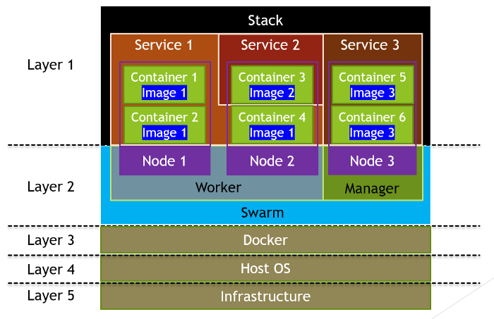

# Docker Swarm

## Conceitos fundamentais

### **Nodes**

É uma instancia (máquina) que participa do Swarm.

### **Manager Node**

Node que gerencia os demais nodes.

### **Worker Node**

Nodes que trabalham em função do do Manager.

### **Service**

Um conjunto de tasks que o manager Node manda o Work Node executar.

### **Task**

Comandos que são executados nos Nodes.

## Plataforma utilizada

Vamos utilizar o DockerLabs para realizar os testes.
> OBS: Para fazer cópias de comandos nessa plataforma utilizamos o ```Ctrl + Ins```

# Comandos do Docker Swarm

## **Para iniciar o Swarm**

```bash
docker swarm init --advertise-addr <IP DA MAQUINA>
```

A máquina vira um Node e um **Manager Node**.

## **Para sair do Swarm**

```bash
docker swarm leave [-f (quando for um Node Manager)]
```

## **Adicionar outros Nodes ao Node Manager**

```bash
docker swarm join --token <TOKEN> <IP>:<PORTA>
# Esse comando é retornado no docker swarm init
```

A máquina entra como **Worker** e todas as Tasks utilizadas no manager, serão replicadas nela.

## **Listar Nodes ativos**

```bash
docker node ls
```

## **Subindo um novo serviço**

```bash
docker service create --name <NOME> [-p <PORTA PC>:<PORTA DOCKER>] <IMAGEM>
# No Node Manager
# É como se fosse o docker run
```

Desta forma teremos um container novo sendo adicionado ao nosso Manager.

## **Listando os serviços**

Para listar os serviços que estão rodando:

```bash
docker service ls
```

## **Removendo serviços**

```bash
docker service rm <NOME>
```

## **Replicando serviços**

Criando serviços já com replicas:

```bash
docker service create --name <NOME> [-p <PORTA PC>:<PORTA DOCKER>] --replicas <NUMERO> <IMAGEM>
```

Adicionar replicas a um serviço já em execução:

```bash
docker service scale <SERVICE>=<NUMERO>
```

## **Checando Token do swarm**

Para verificar novamente o Token para conectar mais nodes, digitamoos o seguinte:

```bash
docker swarm join-token manager
```

## **Checar a estrutura do Docker e do swarm**

```bash
docker info
```

## **Removendo um Node**

```bash
docker node rm [-f] <ID>
```

## **Inspecionando serviços**

```bash
docker service inspect <SERVICE NAME>
```

## **Verificar containers ativados pelo service**

Lista os containers que estão rodando e os que foram encerrados.

```bash
docker service ps <SERVICE NAME>
# Semelhante ao docker container ls -a
```

# Diferença entre Docker Service, Stack, Node e Swarm

[Referência](https://betterprogramming.pub/how-to-differentiate-between-docker-images-containers-stacks-machine-nodes-and-swarms-fd5f7e34eb9f)



## Docker Service

Pode executar um Docker Image em vários contêineres localizados em nós diferentes para executar a mesma funcionalidade.

> Em um aplicativo distribuído, diferentes partes do aplicativo são chamadas de “serviços”.Por exemplo, uma aplicação web de atendimento normalmente contém diferentes tipos de serviços, como front-ends interagindo com os usuários, back-ends processando as entradas dos usuários e armazenamento armazenando os dados do usuário.

> Um serviço executa apenas um tipo de imagem. Um único contêiner em execução em um serviço é chamado de Task. Consulte o diagrama acima — os contêineres no mesmo serviço estão executando a mesma imagem ou executando a mesma funcionalidade. Um serviço codifica uma abordagem de como a imagem deve ser executada, como os números da porta e o número de réplicas dos contêineres. A ampliação de um serviço aumentará o número de contêineres em um serviço, levando a uma alta taxa de transferência desse serviço específico.

> Os contêineres em um serviço não estão necessariamente todos localizados no mesmo nó. De acordo com o diagrama acima, existem três contêineres implantados no Nó 3, dois dos contêineres estão localizados no Nó 1 e outro está localizado no Nó 2.

## Docker Stack

Consiste em vários Docker Services. "Pode executar várias imagens em nós diferentes".

**OBS:** No curso ele foi usado com o Docker-compose.

> De acordo com a definição fornecida na Documentação do Docker, uma Stack é um grupo de serviços inter-relacionados que compartilham dependências e podem ser orquestrados e dimensionados juntos. Referindo-se ao diagrama acima, existem três serviços em uma única Stack. Uma única Stack é capaz de definir e coordenar a funcionalidade de um aplicativo inteiro — a menos que o aplicativo seja altamente complexo e precise ser dividido em várias Stacks.

## Docker Swarm

Contém os Node Managers que gerenciam a associação e delegação e Node Workers que executam serviços do Swarm.

## Node

> Docker Nodes são equivalentes a hosts virtuais. Conforme mostrado no diagrama acima, existem três hosts ou nós virtuais. Cada nó pode representar máquinas físicas ou virtuais. Novamente, os contêineres hospedados no mesmo nó não estão necessariamente atendendo ao mesmo serviço.

# Rodando Compose com Swarm

## Comando

```bash
docker stack deploy -c <ARQUIVO.yaml> <NOME>
```

## Escalando a aplicação

```bash
docker service scale <SERVICE>=<NUMERO>
```

## Fazer um Node não receber mais Tasks

```bash
docker node update --availability drain <ID>
```

**drain** significa não receber mais Tasks

## Atualizando uma imagem do Swarm

```bash
docker service update --image <IMAGEM> <SERVIÇO>
```

## Criando redes no Swarm

Aqui, o tipo do drive é diferente, é o **overlay** pois se trata de conexão ente máquinas diferentes.

- Criamos uma rede com o **driver overlay**
- Adicionamos ao **service create** a flag **--network** o nome da rede overlay

## Conectar um serviço em execução a uma rede

```bash
docker service update --network-add <REDE> <SERVIÇO>
```
